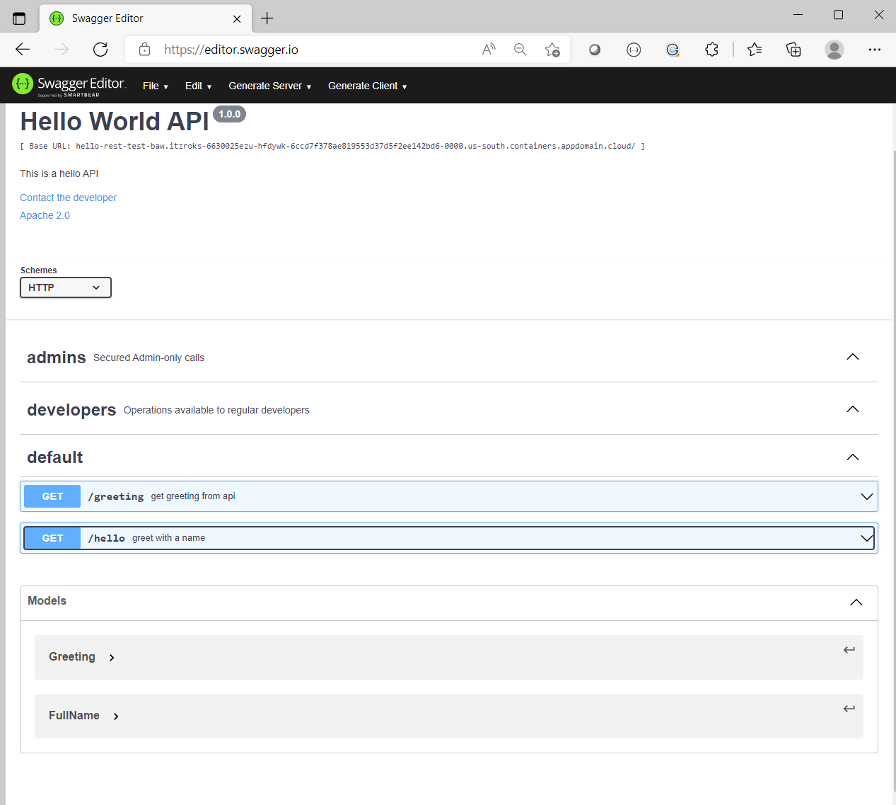

# cp4ba-hello-world

## The mobile APP Git repository
https://github.ibm.com/Maxime-Pavard/CNESST-maternite-demo

## Hello World Rest API

In the directory hello-world-rest there is a small NodeJs application server which expose a small openAPI

  Show the images and describe the openapi
 *   /greeting
 *   /hello
 *   /hello?firstName=Remi&lastName=Cauchon

Here the swagger view of the Hello World REST API

### Deploy the nodejs Server on your Openshift Cluster

Deploy the image with Openshift use the Git

+Add Git Repository  -> From Git    /hello-world-rest    App = hello-world-rest

#### Add database MySQL
Openshift - Developer Catalog

MySQL - Templates - with persistent storage

Connection - 
  user = demo 
  pwssword = demo123 
  root password= root123 
  database name=sampledb
