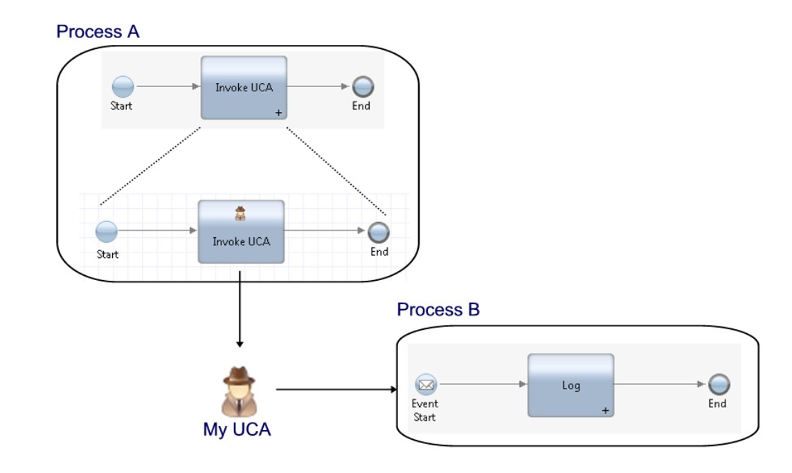
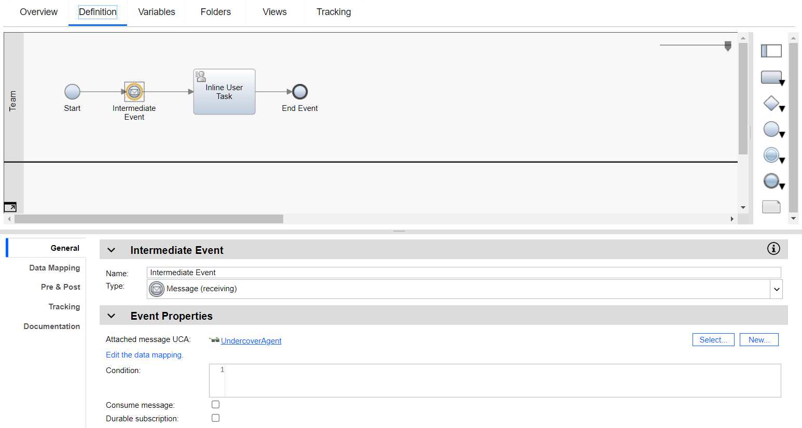
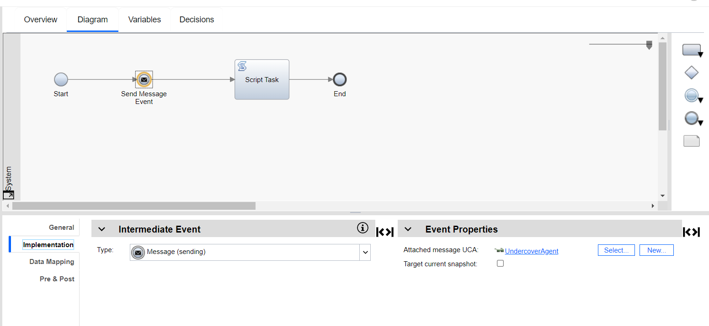

# Documentation on Hello-world Event 

Video on youtube
[here](https://www.youtube.com/watch?v=82vjt4DT0bI)

This directory is a simple event in BAW with the UserClientAgent

Base on this diagram

## But for my example, I have only one event process to send event

### Process receive

### Service send

The trick here to set a correllation ID on the send event process and listen for the same correllation ID on the receiving event

### In the Services tab in the left panel select the "Service Flow dance event"

 + Create 2 variables private
    - correl1   check the default value box "Has default" set it to "123456"
    - data1     check the default value box "Has default" set it to "Your Name"

### In the Processes tab in the left panel select the 
 + Create 2 variables private
    - correlID  check the default value box "Has default" set it to "123456"
    - output2   leave it has is

