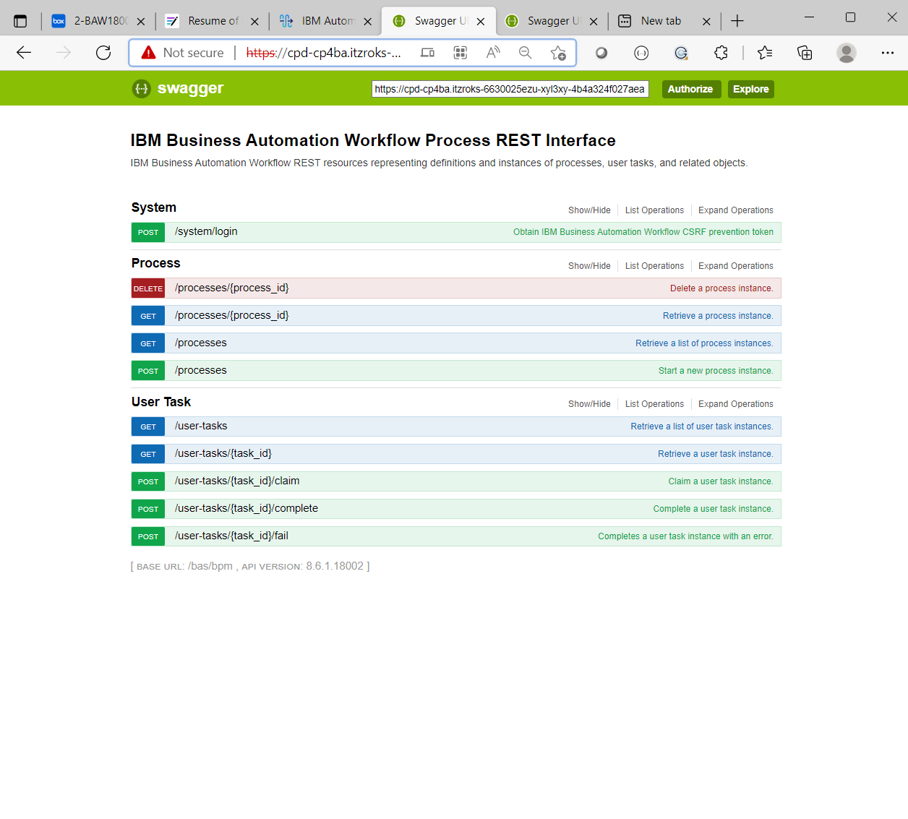
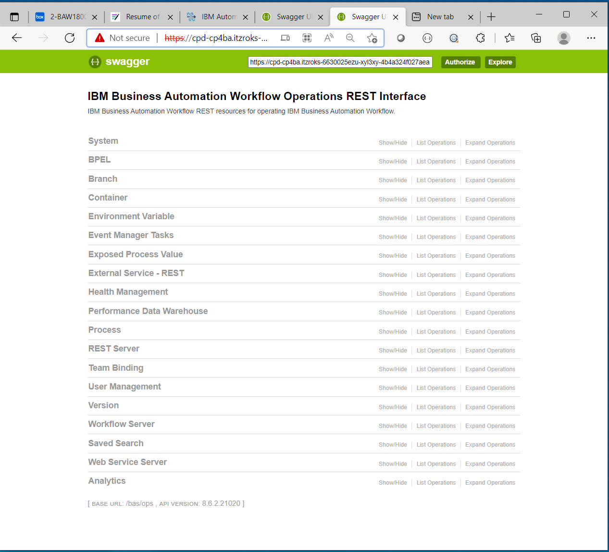

# Hello-World Swagger API, BAW Swagger APIs and POSTMAN to test it

This file **hello-world-openapi-1.0.0.json** is for the openapi available in the nodejs REST API server
import the file on https://editor.swagger.io/

Replace the host by your endpoint cluster URL
```
host: >-
  hello-rest-test-baw.itzroks-6630025ezu-hfdywk-6ccd7f378ae819553d37d5f2ee142bd6-0000.us-south.containers.appdomain.cloud
```
> This will be available after you have deploy your server code Hello-world REST API in the previous directory

### For BAW here the documentation for all REST APIs
[REST (Representational State Transfer) APIs](https://www.ibm.com/docs/en/baw/20.x?topic=apis-rest-representational-state-transfer)

### The BAW Swagger server
There is 2 Swagger server API unning on CP4BA related to Business Automation Workflow

1. Documentation BAW Process REST APIs
[IBM Business Automation Workflow Process REST APIs](https://www.ibm.com/docs/en/baw/20.x?topic=apis-business-automation-workflow-process-rest)

To access the swagger api 
> https://host_name:port_number/bpm/explorer
 
To get the json doc format of the api **https://cluster_url/bpm/docs**



2. Documentation BAW Operations REST APIs
[IBM Business Automation Workflow Operations REST APIs](https://www.ibm.com/docs/en/baw/20.x?topic=apis-business-automation-workflow-operations-rest)

To access the swagger api
> https://host_name:port_number/ops/explorer

To get the json doc format of the api **https://cluster_url/ops/docs**



## Business Process Definition REST resources 
The 3 REST APIs that you need for basic work is the next link

Summary of all methods available on the link below
[REST interface for BPD-related resources](https://www.ibm.com/docs/en/baw/20.x?topic=apis-rest-interface-bpd-related-resources)

## POSTMAN BAW directory

The postman directory contain a workspace to load in your postman application

Take a look at the postman files [here](/hello-world-swagger/postman-baw)
